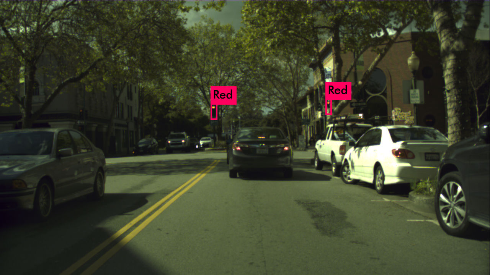

# Detecting Traffic Recognition YOLOv3

Maria Angelica Taylor 
AI for Autonomous Vehicles WPI. 
Assigment 8

We’ve all been there: a light turns green and the car in front of you doesn’t budge. No one likes to get stuck behind a vehicle that doesn’t notice when a light change. Also, a system that can countdown on red light the time remaining until a change to green can save a significant quantity of fuel in city driving (e.g., restart engine five seconds before green) and advise driver to start braking early if it will not make it through a green light. 
In this project, we will develop a model to recognize traffic-light state in the car driving direction. We will use the bosh data set and explain step by step to make test this model. 

Note that the homework instructions indicated to use tensorflow and keras, however the prof. comment on the discussion board that we can use YOLO to acomplish this goal. 

This project is a fork of https://github.com/berktepebag/Traffic-light-detection-with-YOLOv3-BOSCH-traffic-light-dataset

This repo contains the instructions to set up your enviroment and the folder structure, but you need to clone the darknet (YOLO) and bstld repos.

## Demo: 

### Label = Red


### Label = Green
### Label = Yellow
### Label = Off
### Label = Red Left
### Label = Red Right
### Label = Green Left
### Label = Green Right


## Step 1: Download YOLOv3

Here is the <a href='https://pjreddie.com/darknet/yolo/' >YOLO offical page</a> to proceed with setup and for more details. Let's clone and make it with:

```html
git clone https://github.com/pjreddie/darknet
cd darknet
make
```

Now we need some example weights to run YOLO, download it from <a href="https://pjreddie.com/media/files/yolov3.weights">here</a> and save it into darknet folder.

Now we can run an example:

```html
./darknet detect cfg/yolov3.cfg yolov3.weights data/dog.jpg
```

A result image will appear and we can see that YOLO found a dog, a bicycle and a truck. YOLO can be used for multiple images, with webcam and videos.

## Step 2: Download bosh tools

As we already know that we need labels for the input images. In a standart CNN it would be a label for each image but since we are looking for parts of one image we need more than this. So YOLO is asking for a .txt file for each image as:
```html
<object-class> <x> <y> <width> <height>
```

Bosch Small Traffic Lights Dataset is coming with a Python script which turns the dataset into Pascal-VOC like dataset. It is good because YOLO has a script for converting VOC dataset to YOLO styled input. First clone the repository into the extracted dataset folder:  
```html
git clone git@github.com:bosch-ros-pkg/bstld.git
```

If you already don't have SSH key and getting an error, you have to set one and link it to your Github account in order to clone this repository. You can follow <a href="https://help.github.com/en/articles/connecting-to-github-with-ssh"> Github tutorial for SSH</a>.


#### I cloned this repo (bstld) inside the darknet folder 

## Step 3: Download Bosch Small Traffic Lights Dataset:

https://hci.iwr.uni-heidelberg.de/node/6132

Register and a code will be sent to our e-mail address.

Dataset is around 6 GB, so it will take a while to download it. When download is done you should be using 7-zip to open it (In Ubuntu Archieve Manager is not opening the zipped file!), there are 5093 images for training.

## Step 4: Data Folders Preparation - bstld

## Inside the bstld folder you will create a folder named rgb, inside rbg you need to create a folder train and a folder test. Inside train you will crate three folders: 

1. traffic_light_images
2. traffic_light_xmls
3. traffic_light_labels

```html
mkdir rgb
cd rgb
mkdir train
mkdir test
cd train
mkdir traffic_light_images
mkdir traffic_light_xmls
mkdir traffic_light_labels
```
**Update:** PyYaml's load function has been <a href=https://stackoverflow.com/questions/69564817/typeerror-load-missing-1-required-positional-argument-loader-in-google-col>deprecated</a>, so if you are getting an error with yaml.load() you should change bosch_to_pascal.py line 60 to yaml.safe_load() .


Now go back to bstld folder and run bosch_to_pascal.py script, which will create necessary xml files for training with YOLO. Where first argument is PATH_TO_DATASET/train.yaml and second argument is rgb/train/traffic_light_xmls folder which we recently created:
```html
cd ../..
python bosch_to_pascal.py label_files/train.yaml rgb/train/traffic_light_xmls/
```
Now we have 5093 xml label files but we have to convert VOC to YOLO type labels with the script from darknet. 

## Step 5: traffic-lights folder in darknet
Let's go back to the darknet folder and create a folder named traffic-lights. We will put our files in this folder to reach them easily.

```html
mkdir traffic-lights 
cd traffic-lights 
```

To convert VOC type to YOLO type labels, we need to copy the script bosch_voc_to_yolo_converter.py from THIS repo inside the traffic-lights folder.
We need the paths of the .xml files as a list in a .txt file, in order to get it we will copy the script make_xml_list.py from THIS repo inside the traffic-lights folder.
To specify label names, copy the file voc-bosh.names from THIS repo to the traffic-lights folder.
To specify data, copy the file voc-bosh.data from THIS repo to the traffic-lights folder. From the dataset we can see that main lights are RedLeft, Red, RedRight, GreenLeft, Green, GreenRight, Yellow and off. Feel free to add or extract the ones you like. So our classes will be '8'.

Run it:

```html
python make_xml_list.py PATH_TO_DATASET/darknet/bstld/rgb/train/traffic_light_xmls/
```
It you display a mensage: Length of the .xml xml_files:  5093
Also it will create bosch_traffic_light_xmls_list.txt file in the traffic-lights folder. This file will have the .xml paths. 

Now we can convert VOC to YOLO format in the traffic lights folder:

```html
python bosch_voc_to_yolo_converter.py ~/darknet/bstld/rgb/train/traffic_light_labels ./bosch_traffic_light_xmls_list.txt ~/darknet/bstld/rgb/train/traffic_light_images
```

For the arguments, we have to give:
1. output_folder: PATH_TO_DATASET/rgb/train/traffic_light_labels)
2. xmls_list which is a .txt file that has the paths to the xml files: ./bosch_traffic_light_xmls_list.txt
3. Images folder path which we are going to use for training: ~/darknet/bstld/rgb/train/traffic_light_images/

We have to create train.txt and test.txt which are list of the paths' of the relative images. Write a basic splitter script named train_test_split.py:

Copy the file train_test_split.py from THIS repo to the traffic-lights folder. It takes recently created traffic_lights.txt file as first argument and second argument split percentage between 0 to 1. 

```html
python train_test_split.py traffic_lights.txt 0.2
```
test.txt and train.txt is created in the traffic-lights folder. 

Create a backup folder inside traffic-lights folder where we will save our weights as we train, there is an already trained weigths named yolov3-tiny-bosch_40000.weights 
```html
mkdir backup
```
Copy the file from this repo to the backup folder. 

Copy the yolov3-tiny-bosch.cfg into traffic-lights folder.

```html
cp ../cfg/yolov3-tiny.cfg yolov3-tiny-bosch.cfg
```

We will use the transfer learning where we use the pre-trained VOC data and just change the end of the deep-neural-network.

Download <a href="https://pjreddie.com/media/files/darknet53.conv.74"> weights of the darknet53 model</a> and train:

If you want to train run the following command: 

```html
cd ..
./darknet detector train traffic-lights/voc-bosch.data traffic-lights/yolov3-tiny-bosch.cfg darknet53.conv.74
```

After training done (after 30000 images results are getting sufficient) try it with, backup/yolov3-tiny-bosch_40000.weights is already in this repo to test. Go to the darknet top folder to run the following cmd. 

## Image Demo

```html
./darknet detector test traffic-lights/voc-bosch.data traffic-lights/yolov3-tiny-bosch.cfg traffic-lights/backup/yolov3-tiny-bosch_40000.weights data/40344.png
```

## Video Demo

Let's try our classifier with a video:

```html
./darknet detector demo traffic-lights/voc-bosch.data traffic-lights/yolov3-tiny-bosch.cfg traffic-lights//backup/yolov3-tiny-bosch_40000.weights <video file>
```

### Probable Problems with OpenCv
	
If you are having problem while running make with OpenCv=1
Go to the Makefile in the darknet folder and change to OpenCV=1, in the terminal make again.